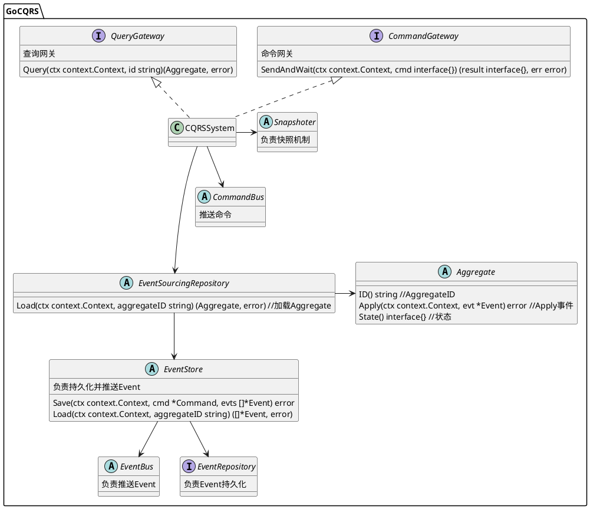

最近工作中想基于Event Sourcing重新设计计费系统。团队主要采用Go技术栈，而Go生态不成熟，缺少成熟CQRS框架实现，所以想着自己动手写个。参考[Axon](https://axoniq.io/)，整体设计如下。

```plantuml
@startuml

package GoCQRS {
    interface CommandGateway {
        命令网关
        SendAndWait(ctx context.Context, cmd interface{}) (result interface{}, err error)
    }
    interface QueryGateway {
        查询网关
        Query(ctx context.Context, id string)(Aggregate, error)
    }

    class CQRSSystem
    abstract CommandBus {
        推送命令
    }

    abstract EventBus {
        负责推送Event
    }
    abstract EventSourcingRepository {
        Load(ctx context.Context, aggregateID string) (Aggregate, error) //加载Aggregate
    }
    
    abstract EventStore {
        负责持久化并推送Event
        Save(ctx context.Context, cmd *Command, evts []*Event) error
        Load(ctx context.Context, aggregateID string) ([]*Event, error)
    }
    interface EventRepository {
        负责Event持久化
    }
    abstract Aggregate {
        ID() string //AggregateID
        Apply(ctx context.Context, evt *Event) error //Apply事件
        State() interface{} //状态
    }

    abstract Snapshoter {
        负责快照机制
    }
    CommandGateway <|.. CQRSSystem
    QueryGateway <|.. CQRSSystem
    EventSourcingRepository --> EventStore
    EventSourcingRepository -> Aggregate
    EventStore --> EventRepository
    EventStore --> EventBus
    CQRSSystem -> Snapshoter
    CQRSSystem ---> EventSourcingRepository
    CQRSSystem --> CommandBus
}


@enduml

```
