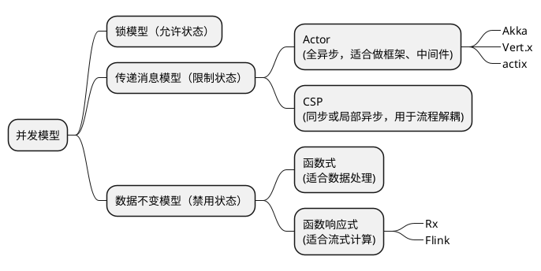

# 【分享】并发模型

by a3d21, 2021-03-14

---

## 并发vs并行

<div class="fragment">
    
| 并发           | 并行           |
| -------------- | -------------- |
| 是一种程序结构 | 是一种运行方式 |
    
</div>

----

<!--

## 并发为什么重要？

并发的本质是时间与通信问题，处理并发所遭遇的复杂度，实际上是物理世界基本复杂性的一种反映。
—— Lamport

---
-->

## 并发模型

目的：简化并发程序设计，使程序更容易并行。

---

### 一 锁模型

----

Go锁常见坑1 读写锁重入死锁

```go

type Student struct {
	sync.RWMutex

	mathScore, engScore int //成绩
	rank                int //排名
}

func (s *Student) MathScore() int {
	s.RLock()
	defer s.RUnlock()
	return s.mathScore
}

func (s *Student) EngScore() int {
	s.RLock()
	defer s.RUnlock()
	return s.engScore
}
```

----

```go
func (s *Student) Total() int {
	s.RLock()
	defer s.RUnlock()
    
	return s.MathScore() + s.EngScore()
}

func (s *Student) SetRank(r int) {
	s.Lock()
	defer s.Unlock()
	s.rank = r
}
```

----

Fix
<ul>
    <li class="fragment">分离Score和Total锁(锁拆分)</li>
    <li class="fragment">可重入锁</li>
    <li class="fragment">STM</li>    
</ul>


----

Go锁常见坑2 双重检验锁
```go
type Cache struct {
	sync.Mutex

	supplier func(string) string
	data     map[string]string
}

func (c *Cache) Get(k string) string {
	if v, ok := c.data[k]; ok {
		return v
	}

	c.Lock()
	if v, ok := c.data[k]; ok {
		return v
	}
	v := c.supplier(k)
	c.data[k] = v
	c.Unlock()
	return v
}
```

----

Fix
<ul>
    <li class="fragment">引入RWLock（读写互斥）</li>
    <li class="fragment">使用`sync.Map`（保证Map读写并发安全）</li>
    <li class="fragment">`sync.Map` + `sync.Once` （锁拆分，锁细化）</li>
</ul>

---


### 二 消息传递模型

----

#### 2.1 Actor


```plantuml
'!include https://raw.githubusercontent.com/bschwarz/puml-themes/master/themes/lightgray/puml-theme-lightgray.puml

!theme lightgray
left to right direction

agent Actor as a1
agent Actor as a2
agent Actor as a3
agent Actor as a4
agent Actor as a5

a1 --> a2
a1 --> a3
a2 --> a4
a2 --> a5
a3 --> a5
```

----

特点
- 全异步，非阻塞
- 无锁（Lock-Free）
- 分布式友好

----

极简例子
```scala
// scala + akka
class HelloActor extends Actor {
  def receive = {
    case "hello" => println("hello back at you")
    case _       => println("huh?")
  }
}

object Main extends App {
  val system = ActorSystem("HelloSystem")
  // default Actor constructor
  val helloActor = system.actorOf(Props[HelloActor], name = "helloactor")
  helloActor ! "hello"
  helloActor ! "buenos dias"
}
```

----

Akka聊天室


---


#### 2.2 CSP

```plantuml
''!include https://raw.githubusercontent.com/bschwarz/puml-themes/master/themes/lightgray/puml-theme-lightgray.puml
!theme lightgray
left to right direction
queue Input as input
queue Output as output

queue "Message" as q1
queue "Message" as q2
queue "Message" as q3
queue "Message" as q4

agent Worker as w1
agent Worker as w2
agent Worker as w3
agent Worker as w4
agent Worker as w5
agent Worker as w6

input --> w1
w1 --> q1
w1 --> q2
q1 --> w2
q2 --> w3
w2 --> q3
w2 --> q4
w3 --> q4
q3 --> w4
q4 --> w5
q4 --> w6
w4 --> output
w5 --> output
w6 --> output

```

----

例子：$y=x^2+1$

```plantuml

''!include https://raw.githubusercontent.com/bschwarz/puml-themes/master/themes/lightgray/puml-theme-lightgray.puml
!theme lightgray
left to right direction

rectangle PowFunc {
    queue Intput as input
    agent "^2" as pow1
    agent "^2" as pow2
    input --> pow1
    input --> pow2
}

rectangle IncFunc {
    queue Mid as mid

    pow1 --> mid
    pow2 --> mid


    agent "+1" as inc
    mid --> inc
}
queue Output as output
inc --> output

```

----

Go CSP
```go

type IntChan chan int

func pow2(threads int, in IntChan) IntChan {
	out := make(IntChan)

	for i := 0; i < threads; i++ {
		go func() {
			for v := range in {
				out <- v * v
			}
		}()
	}

	return out
}

func inc(threads int, in IntChan) IntChan {
	out := make(IntChan)

	for i := 0; i < threads; i++ {
		go func() {
			for v := range in {
				out <- v + 1
			}
		}()
	}

	return out
}

type System struct {
	in, out IntChan
}

func (s *System) Calc(v int) int {
	s.in <- v
	return <-s.out
}

func mkSystem() *System {
	in := make(IntChan, 1)
	out := inc(1, pow2(2, in))
	return &System{
		in:  in,
		out: out,
	}
}

func main() {
	s := mkSystem()
	for i := 0; i < 3; i++ {
		fmt.Println(s.Calc(i))
	}
}

```

----

对比

| Actor      | CSP                              |
| ---------- | -------------------------------- |
| 关注Actor  | 关注Channel                      |
| 异步       | 同步（局部异步）                 |
| 无锁       | 需要锁实现                       |
| 支持单机和分布式运行 | 单机（分布式下对应的产物是MQ） |

---


### 三 数据不变模型

----


#### 3.1 函数式编程（Functional Programming，FP）

----

Function vs Method

| （纯）函数                  | 方法                |
| ---------------------- | -------------------- |
| 是一种映射             | 是一组操作                 |
| 无状态（引用透明）     | 有状态（非引用透明） |
| 不产生可见影响（无副作用） | 产生可见影响（副作用）   |
| 通过组合函数解决问题           | 通过操作API解决问题      |


----

##### 举个粟子：多页词频统计


----

串行

```clojure
(def pages ["Alice was beginning to get very tired of sitting by her sister on the bank, ", 
"and of having nothing to do: once or twice she had peeped into the book her sister was reading, ", 
"but it had no pictures or conversations in it, `and what is the use of a book,' thought Alice `without pictures or conversation?' ", 
"So she was considering in her own mind (as well as she could, for the hot day made her feel very sleepy and stupid)," ])

(defn get-words [text] (re-seq #"\w+" text))

(defn count-words-sequential [pages]
  (frequencies (mapcat get-words pages)))

```

----

并行：Map-Reduce

```clojure
(defn count-words [pages]
  (->> pages
    (partition-all 2)
    (pmap count-words-sequential)
    (reduce (partial merge-with +))))
```

----

真实场景：一个分布式爬虫，爬热门微博及评论，提交Spark分析热门话题。

----

Pure-FP的问题？
状态无处不在 -> 事件时序函数$x(t)$

---

#### 3.2 函数响应式编程（Functional Reactive Programming，FRP）


```plantuml
''!include https://raw.githubusercontent.com/bschwarz/puml-themes/master/themes/lightgray/puml-theme-lightgray.puml
!theme lightgray
agent "<math>x(t)</math>" as x
agent "<math>x'(t)</math>" as x2
agent "<math>y(t)</math>" as y
agent "<math>a(t)</math>" as a
rectangle "Function" as fn

x -> x2 :Map
x2 --> fn
y -> fn
fn -> a :Zip

```

----

##### 举个粟子：用户风险预警，1s内操作>3。

----

```go
//rxgo
type Event struct {
	Name   string
	Action string
}

type Alarm struct {
	Name  string
	Count int
}

func main() {
	in := make(chan rxgo.Item)

	go func() {
		for range time.Tick(100 * time.Millisecond) {
			in <- rxgo.Of(Event{
				Name:   "foo",
				Action: "put",
			})
		}
	}()

	out := rxgo.FromChannel(in).
		BufferWithTime(rxgo.WithDuration(time.Second)).
		Filter(func(it interface{}) bool {
			return len(it.([]interface{})) >= 3
		}).
		Map(func(_ context.Context, it interface{}) (interface{}, error) {
			return Alarm{
				Name:  it.([]interface{})[0].(Event).Name,
				Count: len(it.([]interface{})),
			}, nil
		}).
		Observe()

	for a := range out {
		fmt.Println("alarm:", a)
	}

}

----

真实场景：实时采集用户位置、信用卡消费事件，推送Kafka，基于Flink和规则引擎进行风控。eg: 一日内同地区消费总金额>10w或跨地区消费>3笔

----

#### 小结

相同
- 数据不变
- 通过组合函数解决问题

----

不同
- FP不允许状态，适合数据处理；FRP将状态看成$x(t)$函数，用FP的思想处理状态
- FP对应批处理；FRP对应流式计算

---


### 总结

---

#### 并发模型



---

## Q&A？

---